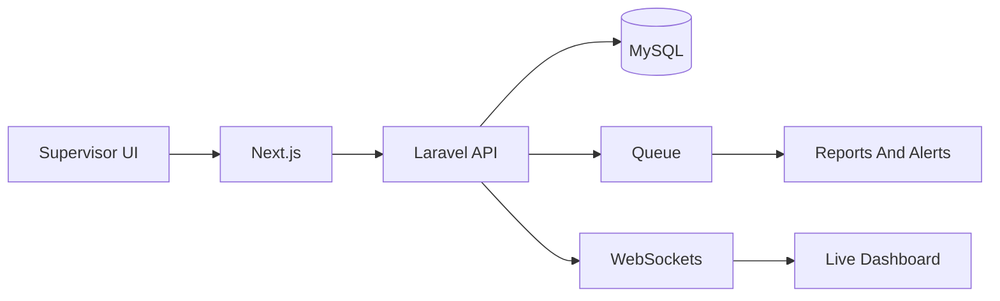
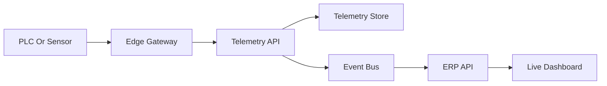

# Smart Factory ERP Architecture

## Scope

The first production release targets one plastic factory with supervisor-entered machine and production data. The system is designed as a modular monolith so production, maintenance, inventory, orders, quality, analytics, realtime alerts, and RBAC share one transactional Laravel API while keeping clear module boundaries.

## Architecture Decisions

- Use `frontend` for the Next.js Arabic RTL dashboard.
- Use `backend` for a Laravel API-only application.
- Keep high-frequency PLC/IoT ingestion out of the ERP core for the MVP.
- Broadcast supervisor-entered production, waste, maintenance, and machine status changes to live dashboards.
- Keep all important operational writes auditable.

## Module Boundaries

- Machine Management owns machines, types, current status, and machine timelines.
- Production owns shifts, work orders, machine assignments, production entries, waste entries, and mold-machine settings.
- Maintenance owns breakdown tickets, repair actions, preventive plans, and downtime.
- Inventory owns materials, products, warehouses, stock levels, lots, and inventory transactions.
- Quality owns inspections, defects, and release/block decisions.
- Orders owns customer orders, order items, and manufacturing status.
- Analytics reads from operational modules and produces KPIs and reports.
- Alerts and Realtime publish operational events to dashboards.

## Runtime Flow

## Future IoT Flow

