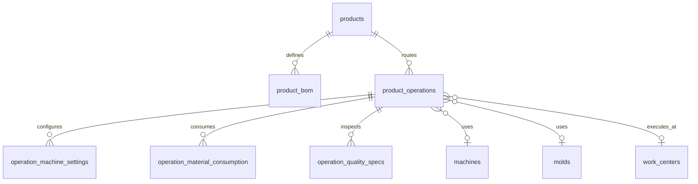

# Industrial Manufacturing Architecture — Product Routing

## Core principle

**BOM and manufacturing operations are complementary, not exclusive.**

A product may simultaneously have:

- A BOM (raw materials, components, subassemblies, packaging, consumables)
- Manufacturing operations (injection, blow, assembly, packaging, …)
- Machine and mold assignments **on operations**, not directly on the product

This mirrors SAP PP and Odoo MRP patterns.

## Manufacturing modes

| Mode | Meaning | Example |
|------|---------|---------|
| `manufactured` | Produced on machines via routing | Bottle body (blow only) |
| `assembled` | Built from BOM/components | Complete bottle (body + cap + handle) |
| `hybrid` | Both make and assemble | Bottle cap (PP resin BOM + injection op) |
| `purchased` | Externally sourced | Raw resin purchased |

`manufacturing_mode` is **auto-derived** when BOM lines or operations change via `ManufacturingModeService`.

## Entity model



Legacy tables (`product_molds`, `product_machine_settings`) remain for backward compatibility but **operations are canonical** for new data.

## Tables

| Table | Purpose |
|-------|---------|
| `products.manufacturing_mode` | manufactured / assembled / hybrid / purchased |
| `product_operations` | Routing steps (sequence, type, machine, mold, times) |
| `operation_machine_settings` | Injection pressure, temperatures, shot weight, … |
| `operation_material_consumption` | Planned/actual/waste per operation |
| `operation_quality_specs` | Per-operation QC tolerances |
| `work_centers` | Future MES work-center grouping |

## API

```
GET    /api/v1/products/:id/operations
POST   /api/v1/products/:id/operations
PATCH  /api/v1/product-operations/:id
DELETE /api/v1/product-operations/:id
GET    /api/v1/products/:id/routing
```

`GET /routing` returns unified flow: BOM materials → sequential operations, plus `assignedMachines`, `assignedMolds`, `machineParameters`, `qcSpecifications`, `packagingOperations`.

## Validation

- Machine type must match operation type (injection → injection machine)
- Mold type must match operation type
- Mold–machine compatibility enforced via `MoldMachineCompatibility`
- Unique `(product_id, sequence_order)` and `(product_id, operation_code)`
- Manufacturing operations must precede assembly/packaging in sequence

## Frontend

| Page | Path |
|------|------|
| Product detail (all sections) | `/ar/products/[id]` |
| Routing editor | `/ar/products/[id]/routing` |
| BOM tree editor | `/ar/products/[id]/bom` |

Product detail shows: information, BOM, operations, machines, molds, machine parameters, QC specs, packaging ops, and routing flow diagram.

## MES readiness

Operations are designed as the execution anchor for future:

- OEE / downtime tracking
- Production scheduling
- IoT counters
- Batch traceability
- Operator terminals

Work orders and production entries will link to `product_operations` in a follow-up phase.
