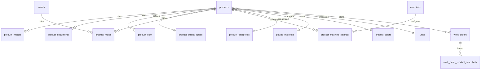

# Product Master Module — Industrial ERP Architecture

## Stack alignment

This implementation follows **SAP/Odoo-style manufacturing master data** patterns, adapted to the existing MyFactory stack:

| Requested | Implemented | Reason |
|-----------|-------------|--------|
| PostgreSQL | **MySQL** | Current production DB (XAMPP) |
| Prisma ORM | **Laravel Eloquent** | Existing backend architecture |
| UUID PK | **bigint PK** | Consistency with machines, molds, work_orders |
| TypeScript DTOs | **Zod + TS interfaces** | Frontend validation layer |

Future migration to PostgreSQL/UUID is supported via nullable `tenant_id`, `factory_id`, `branch_id`.

## Entity model



## Core principle: Product as manufacturing master

The product entity is the **single source of truth** for:

- What is produced (finished / semi-finished / raw / packaging)
- How it is produced (injection, PET, compression, PE)
- What materials it consumes (BOM)
- Which molds and machines can run it
- Quality acceptance criteria
- Technical documentation and images

## Normalized tables

| Table | Purpose |
|-------|---------|
| `products` | Product Master (extended legacy table) |
| `product_categories` | Hierarchical categories |
| `plastic_materials` | PET, HDPE, PP, … |
| `product_colors` | Color master + hex |
| `units` | Measurement units |
| `product_images` | Multi-image gallery |
| `product_documents` | PDFs, datasheets, QC sheets |
| `product_bom` | Bill of materials |
| `product_quality_specs` | QC tolerances & tests |
| `product_molds` | **M:N** product ↔ mold |
| `product_machine_settings` | Per-machine setup parameters |
| `work_order_product_snapshots` | Historical spec freeze for work orders |

## Product ↔ Mold (M:N)

Legacy `molds.product_id` is retained for backward compatibility.  
New canonical link: **`product_molds`** pivot with `priority`, `is_default`, `notes`.

Migration backfills pivot rows from existing `molds.product_id`.

## API surface

```
GET    /api/v1/products/masters
GET    /api/v1/products
POST   /api/v1/products
GET    /api/v1/products/:id
PATCH  /api/v1/products/:id
DELETE /api/v1/products/:id
GET    /api/v1/products/:id/bom
GET    /api/v1/products/:id/molds
GET    /api/v1/products/:id/machine-settings
POST   /api/v1/products/:id/images
POST   /api/v1/products/:id/documents
```

Permissions: `products.view`, `products.manage`

## Frontend structure

```
frontend/
├── lib/api/products-client.ts
├── features/products/management/
│   ├── products-registry-workspace.tsx
│   ├── product-form-workspace.tsx
│   ├── product-form.tsx
│   ├── product-form-schema.ts
│   ├── product-detail-workspace.tsx
│   ├── product-uploaders.tsx
│   └── product-status-ui.ts
└── app/ar/(dashboard)/products/
    ├── registry/page.tsx
    ├── new/page.tsx
    ├── [id]/page.tsx
    └── [id]/edit/page.tsx
```

## Backend structure

```
backend/app/
├── Domain/Factory/Enums/          ProductType, ManufacturingType, …
├── Domain/Factory/Models/         Product, ProductBom, ProductMold, …
├── Application/Products/          ProductService, ProductImageService, …
└── Interfaces/Http/
    ├── Controllers/Api/V1/ProductController.php
    ├── Controllers/Api/V1/Products/ProductImagesController.php
    └── Support/SerializesProducts.php
```

## Inventory & production integration (roadmap)

| Module | Current state | Next step |
|--------|---------------|-----------|
| `work_orders` | FK `product_id` | Capture snapshot on WO release |
| `production_entries` | Via mold only | Derive product from `product_molds` |
| `stock_levels` | Polymorphic ready | Morph `Product` as item_type |
| `inventory_transactions` | Schema only | Issue/consume from BOM |

## Bonus recommendations

1. **QR / Barcode** — generate from `product_code` + `sku` (JsBarcode / endroid/qr-code)
2. **Costing engine** — roll up BOM material costs + machine hour rates
3. **OEE** — link `target_output_per_hour` with production entries
4. **Batch traceability** — lot table referencing product + mold + machine
5. **Predictive maintenance** — correlate mold cycles from linked products
6. **Multi-factory** — activate `tenant_id` / `factory_id` filters in ProductService

## Migration

```bash
cd backend
php artisan migrate
php artisan db:seed   # adds products.view / products.manage permissions
```

Re-login after seeding to refresh Sanctum user permissions.
